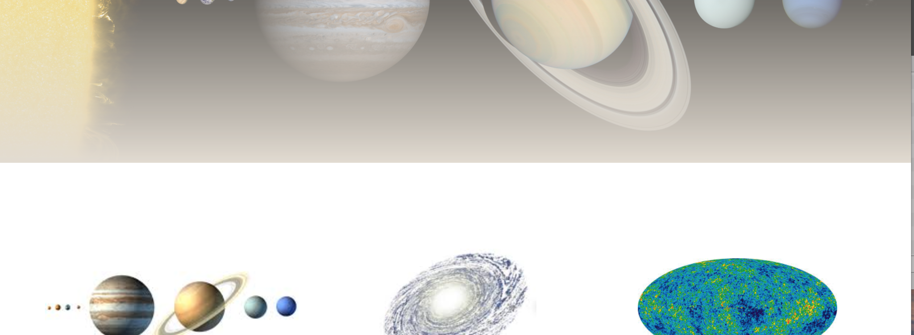
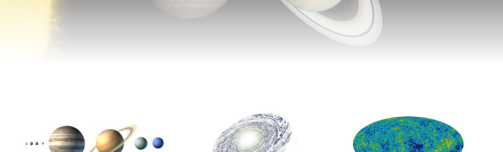

### Research

In order to make the best use of my time for this project I decided to leverage additional frameworks\libraries\preprocessors..ect.  The first thing I researched was which `frontend framework` had the most traction with React.  There are quite a few out there and by that I mean lots and lots of them so I decided to start my search looking for articles that either compared or provided their take on the top 10.  Here are a few of the articles: 

[Top 10 UI Libraries for Developing React Apps](https://www.dhruvkumarjha.com/articles/top-ten-ui-libraries-for-developing-react-js-applications)

### Bootstrap

### Ideas For Refactoring

##### Main.js 

The Main component renders a repeating design of 3 cols stuctured almost identically.  The differences reside in class names and supporting 

### Issues & Resolution

**Issue**: Adding link to CSS in public/index.html has applied css to ul. </br>
**Resolution**: Added margin:0 to App.css


**Issue**: Setting backgroundImage:`url(${allPlanetsSmall})` inline errors out. </br>
**Resolution**: This was pulled directly from [react docs](https://reactjs.org/docs/dom-elements.html)

```
const divStyle = {
  backgroundImage: 'url(' + allPlanetsSmall + ')',
};

function HelloWorldComponent() {
  return <div style={divStyle}>Hello World!</div>;
}
```

**Issue**: The  in header's heroShot class bleeds out of header by about 100px.  Both object-fit: cover\contain produce the same bleed. </br>
**Resolution**: Set height on header to 100%.  

**Issue**: Aligning the button with bottom 0 of the parent div container. </br>
**Resolution**: 

**Issue**: Trying to bleed the heroshot into the main section</br>
**Resolution**: The following worked only to apply a gradient to image and needed to be applied to img tag.  This was pulled from [SO](https://stackoverflow.com/questions/19713813/fade-image-to-transparent-like-a-gradient) and I need to do some more research on using mask-image property as I've never heard of it before this moment.  

```
.heroShot img {
 	-webkit-mask-image:-webkit-gradient(linear, left top, left bottom, from(rgba(0,0,0,1)), to(rgba(0,0,0,0)))
}
```



If a `linear-gradient` is also applied simultaneously to the `header` then this achieves the effect I'm looking for. 

```
.heroShot {
	background: linear-gradient(to bottom, rgba(255,255,255,0) 0%,rgba(255,255,255,1) 80%);
}
```


I'd still like to limit the range of bleed to a shorter vertical so that the planets maintain most of their vibrant colors. 
